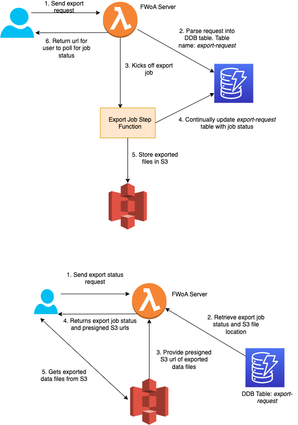

### Testing bulk data export

Bulk Export allows you to export data from DDB to S3. We currently support the [System Level](https://hl7.org/fhir/uv/bulkdata/export/index.html#endpoint---system-level-export) export and [Group Export](https://hl7.org/fhir/uv/bulkdata/export/index.html#endpoint---group-of-patients).
For more information about bulk export, refer to the FHIR [Implementation Guide](https://hl7.org/fhir/uv/bulkdata/export/index.html).

In FWoA, bulk export was implemented using AWS Glue and AWS Step Functions, together with other FWoA resources.



To test this feature on FHIR Works on AWS:

- **For deployment package**, make API requests using the [Fhir.postman_collection.json](../deployment/postman/Fhir.postman_collection.json) file.
- **For smart-deployment package**, make API requests using the [Fhir.postman_collection.json](../smart-deployment/postman/FHIR_SMART.postman_collection.json) file.

1. In the FHIR Examples collection, under the **Export** folder, use `GET System Export` or `GET Group Export` request to initiate an export request.
2. In the response, check the Content-Location header field for a URL. The URL should be in the `<base-url>/$export/<jobId>` format.
3. To get the status of the export job, in the **Export** folder, use the GET Job Status request. Enter the `jobId` value from step 2 in that request.
4. Check the response that is returned from `GET Job Status`. If the job is in progress, the response header will have the field `x-progress: in-progress`. Keep polling that URL every 10 seconds until the job is complete. Once the job is complete, you'll get a JSON body with presigned S3 URLs of your exported data. You can download the exported data using those URLs.
   Example:

```sh
{
    "transactionTime": "2021-03-29T16:49:00.819Z",
    "request": "https://xyz.execute-api.us-west-2.amazonaws.com/$export?_outputFormat=ndjson&_since=1800-01-01T00%3A00%3A00.000Z&_type=Patient",
    "requiresAccessToken": false,
    "output":
    [
        {
            "type": "Patient",
            "url": "https://fhir-service-dev-bulkexportresultsbucket-.com/abc"
        }
    ],
    "error": []
}
```

**Note**: To cancel an export job, use the `Cancel Export Job` request in the "Export" folder located in the Postman collections.
