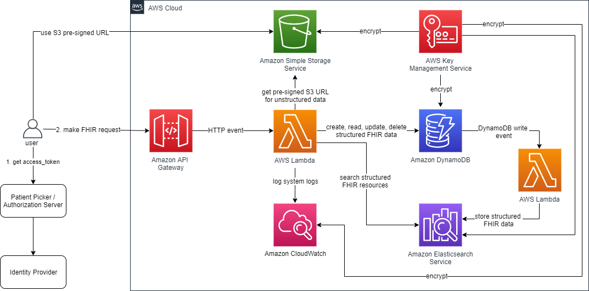
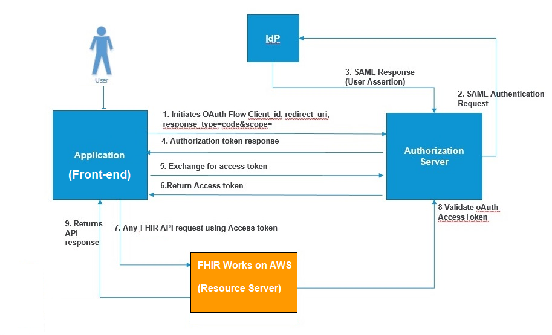
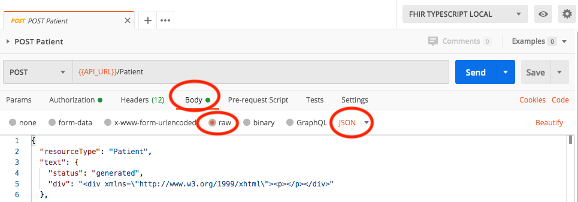

# FHIR Works on AWS deployment `smart` branch

## Upgrade notice

Versions 3.1.1 and 3.1.2 of the `fhir-works-on-aws-authz-smart` package have been deprecated for necessary security updates. Please upgrade to version 3.1.3 or higher. For more information, see [the fhir-works-on-aws-authz-smart security advisory](https://github.com/awslabs/fhir-works-on-aws-authz-smart/security/advisories/GHSA-vv7x-7w4m-q72f).

## Summary

FHIR Works on AWS is a framework that can be used to deploy a [FHIR server](https://www.hl7.org/fhir/overview.html) on AWS. Using this framework, you can customize and add different FHIR functionality to best serve your use cases. The power of this framework is being able to customize and add in additional FHIR functionality for your unique use-case. An example of this, is this implementation uses [DynamoDB](https://github.com/awslabs/fhir-works-on-aws-persistence-ddb). Say you don't want to use DynamoDB, you could implement your own persistence component and plug it into your deployment package. With FHIR Works on AWS you control how your FHIR server will work! This branch is an example implementation of this framework and the [Substitutable Medical Applications, Reusable Technologies (SMART on FHIR) specification](https://docs.smarthealthit.org/).

> **Note**  
> To use this SMART implementation, it is expected that you already have an OAuth2 SMART compliant authorization server. To learn more please check out [OAuth2 Flow](#oauth2-flow) and [Authorization Prerequisites](#prerequisites).

## FHIR Works on AWS features

FHIR Works on AWS utilizes AWS Lambda, Amazon DynamoDB, Amazon S3 and Amazon Elasticsearch Service to provide the following FHIR features:

- Create, Read, Update, Delete (CRUD) operations for all R4 or STU3 base FHIR resources
- Search capabilities per resource type
- Ability to do versioned reads ([vread](https://www.hl7.org/fhir/http.html#vread))
- Ability to post a transaction bundle of 25 entries or less. Presently, transaction bundles with only 25 entries or less are supported.
- Compliant with SMART on FHIR clinical scopes and authorizes by what the requestor or patient in context is referenced in. For detailed information check out the [authz-smart package](https://github.com/awslabs/fhir-works-on-aws-authz-smart)

## Accessing FHIR Works on AWS

Do you want to just try out a FHIR server and don't care about SMART? The easiest and quickest way to experience the non-SMART FHIR server is through [AWS solutions](https://aws.amazon.com/solutions/implementations/fhir-works-on-aws/). If you are interested in the SMART experience please continue reading!

## Architecture

The system architecture consists of multiple layers of AWS serverless services. The endpoint is hosted using API Gateway. The database and storage layer consists of Amazon DynamoDB and S3, with Elasticsearch as the search index for the data written to DynamoDB. The endpoint is secured by API keys, SMART on FHIR OAuth2 for authentication and attribute based access control for authorization. The diagram below shows the FHIR server’s system architecture components and how they are related.


### OAuth2 Flow

The below image shows a step by step OAuth flow and where FHIR Works on AWS fits into the overall picture. As you can tell FHIR Works on AWS is not an authorization server or a SMART front-end app. FHIR Works on AWS should be thought of as just the resource server. If you have questions on how to build a SMART compliant authorization server please check out other implementations like [Okta's](https://github.com/oktadeveloper/okta-smartfhir-docs). If you have questions on how to build a SMART compliant front-end application you can check out [growth-chart-app](https://github.com/smart-on-fhir/growth-chart-app). If you still have questions please do not hesitate in opening an issue.



## Components overview

FHIR Works on AWS is powered by single-function components. These functions provide you the flexibility to plug your own implementations, if needed. The components used in this deployment are:

- [Interface](https://github.com/awslabs/fhir-works-on-aws-interface) - Defines communication between the components.
- [Routing](https://github.com/awslabs/fhir-works-on-aws-routing) - Accepts HTTP FHIR requests, routes it to the other components, logs the errors, transforms output to HTTP responses and generates the [Capability Statement](https://www.hl7.org/fhir/capabilitystatement.html).
- [Authorization](https://github.com/awslabs/fhir-works-on-aws-authz-rbac) - Accepts the access token found in HTTP header and the action the request is trying to perform. It then determines if that action is permitted.
- [Persistence](https://github.com/awslabs/fhir-works-on-aws-persistence-ddb) - Contains the business logic for creating, reading, updating, and deleting the FHIR record from the database. FHIR also supports ‘conditional’ CRUD actions and patching.
  - Bundle - Supports multiple incoming requests as one request. Think of someone wanting to create five patients at once instead of five individual function calls. There are two types of bundles, batch and transaction. We currently only support transaction bundles of size 25 entries or fewer, but support batch bundles of up to 750 entries. This 750 limit was drawn from the Lambda payload limit of 6MB and an average request size of 4KB, divided in half to allow for flexibility in request size. This limit can also be configured in the `config.ts`, by specifying the `maxBatchSize` when constructing the `DynamoDBBundleService`.
- [Search](https://github.com/awslabs/fhir-works-on-aws-search-es) - Enables system-wide searching (/?name=bob) and type searching (/Patient/?name=bob).
- History - (_Not implemented_) Searches all archived/older versioned resources. This can be done at a system, type or instance level.

## Installation

### Prerequisites

Prior to installing this stack you must know three things of your authorization server:

1. Issuer Endpoint - this is the endpoint that mints the access_tokens and will also be the issuer declared in the access_token as well.
1. OAuth2 API Endpoint - this is probably similar to your issuer endpoint but is the prefix to all OAuth2 APIs.
1. Patient Picker Endpoint - SMART on FHIR supports [launch contexts](http://www.hl7.org/fhir/smart-app-launch/scopes-and-launch-context/) and that will typically include a patient picker application that will proxy the /token and /authorize requests.

### Responsibilities for the OAuth2 IdP

Your IdP is expected to manage the following responsibilities:

- Authentication and management of the JWT token
  - This includes revocation, token refresh and managing the [`state` parameter](http://hl7.org/fhir/smart-app-launch/1.0.0/index.html#app-protection)
- Handling differences between [`public` and `confidential` SMART apps](http://hl7.org/fhir/smart-app-launch/1.0.0/index.html#support-for-public-and-confidential-apps)
- SMART on FHIR [client registration flow](http://hl7.org/fhir/smart-app-launch/1.0.0/index.html#registering-a-smart-app-with-an-ehr) and [launch context flow](http://hl7.org/fhir/smart-app-launch/1.0.0/index.html#smart-launch-sequence)
- Defining and vending supported [SMART on FHIR scopes](http://hl7.org/fhir/smart-app-launch/1.0.0/scopes-and-launch-context/index.html) (`user/Patient.read`, etc)

### Download

Clone or download the repository to a local directory. **Note:** if you intend to modify FHIR Works on AWS you may wish to create your own fork of the GitHub repo and work from that. This allows you to check in any changes you make to your private copy of the solution.

Git Clone example:

```sh
git clone https://github.com/awslabs/fhir-works-on-aws-deployment.git
```

### Install

- [Linux/macOS](./INSTALL.md#linux-or-macos-installation)
- [Windows](./INSTALL.md#windows-installation)
- [Docker](./INSTALL.md#docker-installation)

If you intend to use FHIR Implementation Guides read the [Using Implementation Guides](../../fwoa-utilities/javaHapiValidatorLambda/USING_IMPLEMENTATION_GUIDES.md) documentation first.

If you intend to do a multi-tenant deployment read the [Using Multi-Tenancy](../documentation/USING_MULTI_TENANCY.md) documentation first.

If you intend to use FHIR Subscriptions read the [Using Subscriptions](../documentation/USING_SUBSCRIPTIONS.md) documentation first.

### Post installation

After your installation of FHIR Works on AWS you will need to update your OAuth2 authorization server to set the FHIR Works API Gateway endpoint as the audience of the access token.

### Best Practices

**What is the recommended transport layer security (TLS) setting?**

We advise using TLS v1.2 and TLS v1.3. Because FHIR Works on AWS does not deploy a custom domain, the API Gateway does not allow FHIR Works on AWS to require TLS v1.2. Please refer to: [Choosing a minimum TLS version for a custom domain in API Gateway](https://docs.aws.amazon.com/apigateway/latest/developerguide/apigateway-custom-domain-tls-version.html).

**What cipher suite is recommended?**

TLS v1.3 is the latest standard that only supports strong ciphers with authenticated encryption (AEAD).
TLS v1.2 must be configured to provide acceptable security by only using cipher suites that have the following:

- Elliptic Curve Diffie-Hellman Ephemeral (ECDHE) for key exchange to support Forward Secrecy
- Block ciphers (e.g., AES) in GCM mode (avoid the use of CBC mode)

Avoid using TLSv1.0, TLS v1.1, and insecure 3DES and CBC cipher suites, which have known vulnerabilities and if exploited could lead to complete loss of confidentiality and integrity of the application data in transit.

To create a custom domain, see [Setting up custom domain names for REST APIs](https://docs.aws.amazon.com/apigateway/latest/developerguide/how-to-custom-domains.html).

**What are the recommendations for scope settings? (SMART Deployment Only)**

When your IdP vends [SMART scopes](http://hl7.org/fhir/smart-app-launch/1.0.0/scopes-and-launch-context/index.html) in the JWT, the requestor has permission to perform defined scope actions.

When vending scopes these are our recommendations:

- Do not vend write access scopes to patients or 3rd party entities. For example, if a patient logs into your IdP we do not recommend vending `patient/Patient.write` scope.
- Do not vend wildcard (`*`) scopes, like `user/*.*`.
- When vending system scope, do not vend other types of scopes. For example, we do not recommend vending `system/Patient.read` `patient/Encounter.read`.
- Follow the principle of least privilege. This is a concept that limits user access scopes to the minimum access necessary. For example if a patient is trying to read their Observation, that patient wouldn't need the `patient/Encounter.read` scope.
- Review and understand how the smart-authz package does [attribute-based access control](https://github.com/awslabs/fhir-works-on-aws-authz-smart/#attribute-based-access-control-abac).
- Review the [FWoA SMART scope rules](https://github.com/awslabs/fhir-works-on-aws-deployment/blob/smart-mainline/src/authZConfig.ts#L9) to modify what operations should be allowed per scope.

For more information about SMART on FHIR Works, see [SMART on FHIR Works FAQ](/SMART_ON_FHIR_FAQ.MD).

**What is the recommendation for token expiration period?**

We recommend configuring your IdP to set token expiration within 15-30 minutes, or less, of when issued.

**What is the recommendation for optional deployment configurations?**

We recommend configuring your deployment of FHIR Works to enable the `VALIDATE_XHTML` flag as an additional layer of security against unsanitized inputs. This can be done by modifying the default value of the variable in [this file](./cdk.json), or by specifying the parameter during deployment with `-c VALIDATE_XHTML=true`.

**Is multi-factor authentication (MFA) delete recommended on S3 buckets?**
Yes, adding MFA delete adds an additional layer of security to your S3 buckets. After enabling [MFA delete](https://docs.aws.amazon.com/AmazonS3/latest/userguide/MultiFactorAuthenticationDelete.html) for your S3 buckets, bucket owners will be required to provide two forms of authentication in requests to delete a bucket version or change its versioning state. To add this extra security layer, refer to [Configuring MFA delete](https://docs.aws.amazon.com/AmazonS3/latest/userguide/MultiFactorAuthenticationDelete.html). Please note, MFA delete will only apply to IAM users and not federated users. To apply MFA delete to federated users, we recommend using [ABAC](https://docs.aws.amazon.com/IAM/latest/UserGuide/id_session-tags.html#id_session-tags_adding-assume-role-saml).

**What is recommended to configure data-event logging?**
[AWS CloudTrail](https://docs.aws.amazon.com/awscloudtrail/latest/userguide/cloudtrail-user-guide.html) is recommended for logging FWoA data events. To configure data-event logging, [create a “trail”](https://docs.aws.amazon.com/awscloudtrail/latest/userguide/cloudtrail-create-and-update-a-trail.html) for your AWS account. Be sure to follow [CloudTrail security best practices](https://docs.aws.amazon.com/awscloudtrail/latest/userguide/best-practices-security.html) when doing so.

**What is recommended for concurrect lambda executions**
Lambda concurrent executions are defined in each lambda function in solutions/smart-deployment/src/lib/cdk-infra-stack.ts. We are using [reserved concurrency](https://docs.aws.amazon.com/lambda/latest/dg/configuration-concurrency.html) and [provisioned concurrency](https://docs.aws.amazon.com/lambda/latest/dg/provisioned-concurrency.html) to configure the number of requests a function can handle at the same time. Follow the guidance [here](https://docs.aws.amazon.com/lambda/latest/dg/lambda-concurrency.html) to customize lambda scaling and concurrency.

### Development

[Instructions for making local code changes](../../DEVELOPMENT.md)

## License

This project is licensed under the Apache-2.0 license.

## Usage instructions

### Retrieving user variables

After installation, all user-specific variables (such as `SERVICE_ENDPOINT`) can be found in the `Info_Output.log` file.

### Accessing the FHIR API

The FHIR API can be accessed through the API_URL using REST syntax as defined by FHIR [here](http://hl7.org/fhir/http.html), using this command:

```sh
curl -H "Accept: application/json" -H "Authorization:<OAUTH2_TOKEN>" -H "x-api-key:<API_KEY>" <API_URL>
```

Other means of accessing the API are valid as well, such as Postman. More details for using Postman are detailed below in the _Using Postman to make API Requests_ section.

#### Using Postman to make API Requests

[Postman](https://www.postman.com/) is an API Client for RESTful services that can run on your development desktop for making requests to the FHIR Server. Postman is highly suggested and will make accessing the FHRI API much easier.

Included in this code package, under the folder “postman”, are JSON definitions for some requests that you can make against the server. To import these requests into your Postman application, you can follow the directions [here](https://kb.datamotion.com/?ht_kb=postman-instructions-for-exporting-and-importing). Be sure to import the collection file: [FHIR_SMART.postman_collection.json](./postman/FHIR_SMART.postman_collection.json).

After you import the collection, you need to set up your environment. You can set up a local environment, or a development environment. Each environment should have the correct values configured for it. For example the _API_URL_ for the local environment might be _localhost:3000_ while the _API_URL_ for the development environment would be your API Gateway’s endpoint.

Instructions for importing the environment JSON is located [here](https://thinkster.io/tutorials/testing-backend-apis-with-postman/managing-environments-in-postman). The environment file is [FHIR_SMART.postman_environment.json](./postman/FHIR_SMART.postman_environment.json)

The API_URL & API_KEY variables required in the POSTMAN collection can be found in `Info_Output.log`.

The remaining variables should be found within your authorization server.

- API_URL: from Service Information:endpoints: ANY
- API_KEY: from Service Information: api keys: developer-key
- OAUTH_URL: this should be your patientPickerEndpoint,
- OAUTH_CLIENT_ID: this is your OAuth client id; found within your authorization server
- OAUTH_CLIENT_SECRET: this is your OAuth client secret; found within your authorization server

To know what all this FHIR API supports please use the `GET Metadata` postman to generate a [Capability Statement](https://www.hl7.org/fhir/capabilitystatement.html).

### Authorizing a user

FHIR Works on AWS assumes the SMART authorization server is set-up outside of this deployment. The assumptions made and requirements of the authorization server can be found in the [authz-smart](https://github.com/awslabs/fhir-works-on-aws-authz-smart) package. At a high-level though the authz-smart package uses the [SMART clinical scopes](http://www.hl7.org/fhir/smart-app-launch/scopes-and-launch-context/#clinical-scope-syntax) and attribute based access control to authorize users. Further customization can be found in the: [authZConfig.ts](src/authZConfig.ts).

### Accessing Binary resources

Binary resources are FHIR resources that consist of binary/unstructured data of any kind. This could be X-rays, PDF, video or other files. This implementation of the FHIR API has a dependency on the API Gateway and Lambda services, which currently have limitations in request/response sizes of 10MB and 6MB respectively. This size limitation forced us to look for a workaround. The workaround is a hybrid approach of storing a Binary resource’s _metadata_ in DynamoDB and using S3's get/putPreSignedUrl APIs. So in your requests to the FHIR API you will store/get the Binary's _metadata_ from DynamoDB and in the response object it will also contain a pre-signed S3 URL, which should be used to interact directly with the Binary file.

### Additional Features

FWoA provides the following additional features on top of the standard offering. Most of these features are turned off by default, and can be turned on through CDK context.

| Name                                                                                                 | CDK context key(s)                                        | Description                                                                                                                                                                          |
| ---------------------------------------------------------------------------------------------------- | --------------------------------------------------------- | ------------------------------------------------------------------------------------------------------------------------------------------------------------------------------------ |
| [Multi-tenancy](../documentation/USING_MULTI_TENANCY.md)                                             | enableMultiTenancy                                        | Multi-tenancy allows a single `fhir-works-on-aws` stack to serve as multiple FHIR servers for different tenants.                                                                     |
| [Subscriptions](../documentation/USING_SUBSCRIPTIONS.md)                                             | enableSubscriptions                                       | FHIR Works on AWS implements Subscriptions v4.0.1: https://www.hl7.org/fhir/R4/subscription.html                                                                                     |
| [Bulk Data Export](../documentation/USING_BULK_DATA_EXPORT.md)                                       | Always enabled                                            | Bulk Export allows you to export data from DDB to S3.                                                                                                                                |
| [Secure Logging](../documentation/SECURE_LOGGING.md)                                                 | enableSecurityLogging logLevel                            | Secure logging includes metadata such as who, what, when, where, how, and other associated request and response data.                                                                |
| [Implementation Guides](../../fwoa-utilities/javaHapiValidatorLambda/USING_IMPLEMENTATION_GUIDES.md) | useHapiValidator igMemoryLimit igMemorySize igStorageSize | An [Implementation Guide (IG)] ( https://www.hl7.org/fhir/implementationguide.html) is a set of rules that describe how FHIR resources should be used to solve a particular problem. |
| Enable OpenSearch Hard Delete                                                                        | enableESHardDelete                                        | FWoA uses soft delete for resource deletion by default. Set enableESHardDelete to true to enable hard delete in OpenSearch cluster.                                                  |
| [Dynamodb Daily Backup](../../../INSTALL.md#dynamodb-table-backups)                                  | enableBackup                                              | Daily DynamoDB Table back-ups can be optionally deployed via an additional fhir-server-backups stack.                                                                                |

Additional customization information can be found in document [CUSTOMIZE.md](../documentation/CUSTOMIZE.md).

#### Postman (recommended)

To test we suggest you to use Postman, please see [here](#using-postman-to-make-api-requests) for steps.

#### cURL

To test this with cURL, use the following command:

1. POST a Binary resource to FHIR API:

```sh
curl -H "Accept: application/json" -H "Authorization:<OAUTH2_TOKEN>" -H "x-api-key:<API_KEY>" --request POST \
  --data '{"resourceType": "Binary", "contentType": "image/jpeg"}' \
  <API_URL>/Binary
```

1. Check the POST's response. There will be a `presignedPutUrl` parameter. Use that pre-signed url to upload your file. See below for command

```sh
curl -v -T "<LOCATION_OF_FILE_TO_UPLOAD>" "<PRESIGNED_PUT_URL>"
```

## Troubleshooting FHIR Works on AWS

- If changes are required for the Elasticsearch instances, you may have to redeploy. Redeployment deletes the Elasticsearch cluster and creates a new one. Redeployment also deletes the data inside your cluster. In future releases, we will create a one-off lambda instance that can retrieve the data from DynamoDB to Elasticsearch. To do this, you can currently use either of the following options:

  - You can manually push the DynamoDB data to Elasticsearch by creating a lambda instance.
  - You can refresh your DynamoDB table with a backup.
  - You can remove all data from the DynamoDB table and that will create parity between Elasticsearch and DynamoDB.

- Support for STU3 and [R4](https://www.hl7.org/fhir/validation.html) releases of FHIR is based on the JSON schema provided by HL7. The schema for R4 is more restrictive than the schema for [STU3](http://hl7.org/fhir/STU3/validation.html). The STU3 schema doesn’t restrict appending additional fields into the POST/PUT requests of a resource, whereas the R4 schema has a strict definition of what is permitted in the request. You can access the schema [here](https://github.com/awslabs/fhir-works-on-aws-routing/blob/mainline/src/router/validation/schemas/fhir.schema.v3.json).

> **Note**  
> We are using the official schema provided by [HL7](https://www.hl7.org/fhir/STU3/downloads.html).

- When making a `POST`/`PUT` request to the server, if you get an error that includes the text `Failed to parse request body as JSON resource`, check that you've set the request headers correctly. The header for `Content-Type` should be either `application/json` or `application/fhir+json`. If you're using Postman for making requests, in the **Body** tab, make sure to change the setting to `raw` and `JSON`.
  

## Feedback

We'd love to hear from you! Please reach out to our team via [Github Issues](https://github.com/awslabs/fhir-works-on-aws-deployment/issues) for any feedback.
